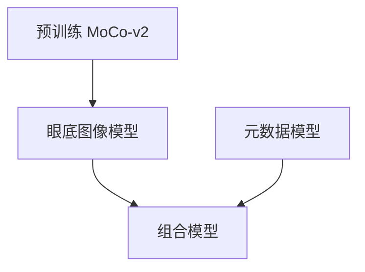
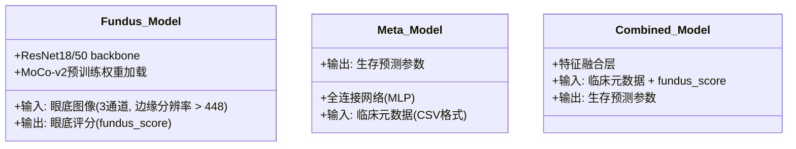

# DeepDR Plus 模型架构文档

## 1. 项目概述

DeepDR Plus 是一个用于预测糖尿病视网膜病变（DR）进展个性化时间的深度学习系统。该系统整合了多种数据源（如眼底图像和临床元数据），旨在提供更精准的风险预测。

系统包含三个核心模型：
- **元数据模型 (Metadata Model)**：基于临床元数据进行预测。
- **眼底图像模型 (Fundus Model)**：基于眼底图像进行预测，并可生成眼底评分。
- **组合模型 (Combined Model)**：结合眼底图像模型生成的评分和临床元数据进行预测。

## 2. 问题定义

本项目的目标是估计给定输入下混合模型的参数和权重，以预测患者的个性化时间到事件进展。

每个患者记录 $s_i$ 定义为 $\langle x_i, t_i, t'_i, e_i \rangle$：
- $x_i$：特征向量（包括基线时的图像特征和/或元数据）。
- $e_i$：表示记录是否被截尾。$e_i = 1$ 表示未截尾（事件已观察到），$e_i = 0$ 表示截尾（未观察到事件）。
- $t_i$：事件发生前最后一次检查的时间。
- $t'_i$：如果事件被观察到，表示事件发生的时间；如果事件未被观察到，则 $t_i = t'_i$。

我们使用 Weibull 混合分布来建模每个参与者的生存函数 $S(t) = \mathbb{P}(T > t)$。

患者的生存函数定义如下：
$$\mathbb{P}(T > t|x) = \sum_{i=1}^K \phi_{i|x} \int_t^\infty f_i(u|\alpha_i,\beta_i)du$$
其中 $f_i(u|\alpha_i,\beta_i)$ 是 Weibull 分布的概率密度函数 (PDF)：
$$f_i(u|\alpha_i,\beta_i) = \frac{\beta_i}{\alpha_i}\left(\frac{u}{\alpha_i}\right)^{\beta_i-1}\exp\left(-\left(\frac{u}{\alpha_i}\right)^{\beta_i}\right)$$
Weibull 分布的累积分布函数 (CDF) 为：
$$\mathbb{P}(T < t|x) = \sum_{i=1}^K \phi_{i|x}(1 - \exp(-(t/\alpha_i)^{\beta_i}))$$
$\alpha_i$ 和 $\beta_i$ 是从高斯分布中抽取的参数，$\phi_{i|x}$ 是一组混合分布的参数。

输入特征矩阵（包括眼底图像和临床元数据）$I$ 通过深度学习网络 $f(\cdot|\Theta)$ 来确定所有参数 $\Theta$。我们使用最大似然估计来估计深度学习网络的参数。

损失函数定义为：
$$\mathcal{L} = -\sum_{i=1}^{|\mathcal{D}|} \ln \sum_{j=1}^K \phi_{j|x}\exp\left(-\left(\frac{t_i}{\alpha_j}\right)^{\beta_j}\right) - \gamma \sum_{i=1}^{|\mathcal{D}|} e_i \ln \sum_{j=1}^K \phi_{j|x}\left(1-\exp\left(-\left(\frac{t'_i}{\alpha_j}\right)^{\beta_j}\right)\right)$$
其中 $\gamma$ 是一个超参数，用于平衡截尾数据和未截尾数据的权重。

## 3. 模型架构设计

DeepDR Plus 系统由三个主要模型组成，它们可以独立或组合使用。

### 3.1 模型关系概览

### 3.2 各模型详细架构

- **眼底图像模型 (Fundus Model)**：
    - 基于 ResNet-18 或 ResNet-50 作为骨干网络。
    - 利用 MoCo-v2 进行预训练以学习图像特征。
    - 接收 3 通道彩色眼底图像作为输入。
    - 输出一个 `fundus_score`，代表图像的特征表示或风险评分。通过以下流程生成：
      1. 图像经过骨干网络提取2048维特征向量
      2. 通过全连接层降维到512维
      3. 使用注意力机制计算各特征权重
      4. 加权求和得到最终评分
    - 对于多张图像，先计算单张评分再进行加权平均

- **元数据模型 (Metadata Model)**：
    - 采用全连接网络 (MLP) 结构。
    - 接收包含标准化临床特征的 CSV 文件作为输入。
    - 输出用于生存预测的参数。

- **组合模型 (Combined Model)**：
    
    > 组合模型的实质是一个元数据模型，在输入函数里面包含了图像评分这一项参数。
    
    - 结合了临床元数据和眼底图像模型生成的 `fundus_score`。
    - 通过特征融合层处理这些输入。
    - 输出用于生存预测的参数。

## 4. 训练流程

### 4.1 数据准备

训练和测试数据应以 CSV 格式组织。对于眼底图像模型，图像文件应存储在指定文件夹中，并在 CSV 文件中包含相对路径。

**支持的图像文件格式**：JPG, PNG, TIF (OpenCV 支持的其他格式也可能兼容)。输入图像必须是 3 通道彩色眼底图像，且最小边缘分辨率大于 448。

**数据列示例**：

- **元数据模型**：
    `t1, t2, e, age, gender, smoker, duration_DM, DR, BMI, HbA1c, SBP, DBP, TG, LDL-C, HDL-C`
- **眼底图像模型**：
    `t1, t2, e, image`
- **组合模型**：
    `t1, t2, e, age, gender, smoker, duration_DM, DR, BMI, HbA1c, SBP, DBP, TG, LDL_C, HDL_C, fundus_score`

**数据预处理**：
- 图像处理：
  - 分辨率统一调整为512x512
  - 标准化：ImageNet均值/方差
  - 数据增强：随机水平翻转、亮度调整
- 元数据处理：
  - 连续变量：Z-score标准化
  - 分类变量：one-hot编码
  - 缺失值：中位数填充（连续变量）/众数填充（分类变量）

**数据列描述**：
- `image`: 预处理后的眼底图像路径
- `t1`: 感兴趣事件前最后一次检查的时间
- `t2`: 感兴趣事件后第一次检查的时间
- `e`: 是否截尾 (1: 未截尾, 0: 截尾)
- `age`: 基线年龄 [单位: 年]
- `gender`: 性别 [female/male]
- `smoker`: 基线吸烟状态 [TRUE/FALSE]
- `duration_DM`: 基线糖尿病病程 [单位: 年]
- `DR`: 基线 DR 等级 [整数 0~4]
- `BMI`: 基线体重指数 [单位: kg/m^2]
- `HbA1c`: 基线糖化血红蛋白 A1c [单位: %]
- `SBP`: 基线收缩压 [单位: mmHg]
- `DBP`: 基线舒张压 [单位: mmHg]
- `TG`: 基线甘油三酯 [单位: mmol/L]
- `LDL_C`: 基线低密度脂蛋白胆固醇 [单位: mmol/L]
- `HDL_C`: 基线高密度脂蛋白胆固醇 [单位: mmol/L]
- `fundus_score`: 眼底图像模型生成的眼底评分 (多张图像取平均值)

### 4.2 预训练阶段 (MoCo-v2)

为了在眼底图像上学习有效的特征表示，我们采用了 MoCo-v2 进行自监督预训练。

- **框架**：基于 [MoCo-v2](https://github.com/facebookresearch/moco-v2) 的开源实现。
- **执行**：进入 `MoCo-v2` 目录，运行 `python main_moco.py`。
- **配置**：可通过修改 `MoCo-v2/config.py` 文件调整配置参数。
- **模型保存**：训练后的模型将保存到 `MoCo-v2/models/resnet50_bs32_queue16384_wd0.0001_t0.2_cos/` 目录。
- **模型选择**：选择验证损失 (eval loss) 最小的模型作为预训练模型。

### 4.3 微调训练阶段

系统提供了命令行工具 `train.py` (或 `train_eval_fund.py`, `train_eval_covar.py`) 用于模型的训练和评估。

**通用超参数设置 (通过环境变量或命令行参数)**：
- `load_pretrain`: 预训练模型路径 (用于微调眼底图像模型)
- `batch_size`: 训练批次大小
- `epochs`: 训练轮次
- `image_size`: 输入图像分辨率
- `lr`: 学习率
- `device`: 训练设备 (CPU/GPU)
- `num_workers`: 数据加载工作进程数
- `model`: 模型名称 (支持 ResNet-18, ResNet-50)

**训练眼底图像模型**：
- 运行 `python train_eval_fund.py`，并设置适当的超参数。
- 若使用预训练模型，需指定 `load_pretrain` 参数，例如：
  `load_pretrain=../MoCo-v2/models/resnet50_bs32_queue16384_wd0.0001_t0.2_cos/599.pth python train_eval_fund.py`

**训练元数据模型**：
- 确保数据集已准备好，包含标准化特征的 CSV 文件。
- 通过命令行参数提供用于训练的特征名称，例如：
  `python train_eval_covar.py age gender smoker duration_DM BMI HbA1c SBP DBP TG LDL_C HDL_C`

**训练组合模型**：
- 首先，从眼底图像模型中提取 `fundus_score` 并添加到 CSV 文件中。
- 通过命令行参数提供用于训练的特征名称，例如：
  `python train_eval_covar.py age gender smoker duration_DM BMI HbA1c SBP DBP TG LDL_C HDL_C fundus_score`

## 5. 评估体系

- **评估结果保存**：评估结果将以 pickle dump 格式保存到 `logs/` 目录。
- **详细信息**：更多评估细节请参考 `trainer.py` 文件。

## 6. 真实世界研究结果

DeepDR Plus系统在真实世界临床工作流中表现出色：

- **筛查间隔**：平均筛查间隔可从12个月延长至31.97个月
- **筛查频率降低**：62.46%（相比固定年度筛查）
- **延迟检测率**：进展为视力威胁型DR的延迟检测率仅为0.18%
- **筛查推荐分布**：
  - 1年：30.62%
  - 2年：20.00% 
  - 3年：19.63%
  - 4年：11.85%
  - 5年：17.89%

### 6.1 三个关键子组分析

系统可预测三种不同类型的DR进展：
1. **非DR到DR**：C-index 0.826 (95% CI, 0.797-0.853)
2. **非可转诊DR到可转诊DR**：C-index 0.820 (95% CI, 0.785-0.853) 
3. **非视力威胁DR到视力威胁DR**：C-index 0.824 (95% CI, 0.758-0.880)

### 6.2 模型解释性
通过注意力图可视化，系统主要关注视网膜血管和中央凹区域，这些区域与DR进展密切相关。
